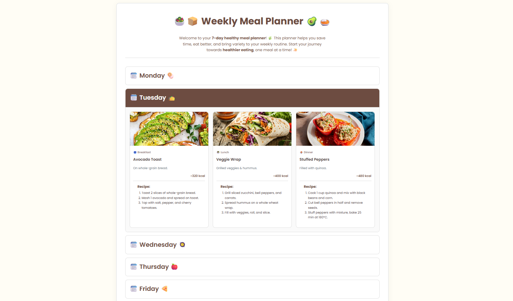

# 🥗 PantryPal 🥑

## 🌟 Overview
**PantryPal** is a visually appealing and **easy-to-use meal planner** that helps users follow a **healthy vegetarian diet** throughout the week. Each day contains a carefully curated menu with **Breakfast, Lunch, and Dinner**, along with approximate calorie information for each meal.  

PantryPal helps users:  
- 🥕 Maintain a balanced diet  
- 🥬 Make healthy meal choices  
- 🍅 Track approximate calories for each meal  
- 🥗 Enjoy a variety of delicious vegetarian dishes  

---

## 🍽️ Features
- 📅 Weekly meal plan: **Monday to Sunday**  
- 🍳 Three meals per day: **Breakfast, Lunch, Dinner**  
- Each meal includes:  
  - 📝 Recipe instructions  
  - 🥦 Ingredients  
  - 🔥 Approximate calories  
- 🖼️ Beautiful visuals and food images for every meal  
- 📱 Fully responsive design for desktop, tablet, and mobile  

---

## 🚀 How to Run
1. Clone or download the project folder.  
2. Open `index.html` in your browser **OR** use VS Code + Live Server extension:  
   - Right-click `index.html` → **Open with Live Server**  
3. Browse the weekly meal plan with recipes, calories, and images.

---

## 🥗 Usage
- Browse each day of the week to see meal options.  
- Click on **Breakfast, Lunch, or Dinner** to view the recipe and ingredients.  
- Use the calorie information to plan your daily intake.  

---

## 💻 Tech Stack
- HTML5  
- CSS3  
- Static images  

---

## 🤝 Contributing
Contributions are welcome!  
1. Fork the repository  
2. Make your changes  
3. Submit a pull request  

---

## 📝 License
This project is **open-source** and free to use.
